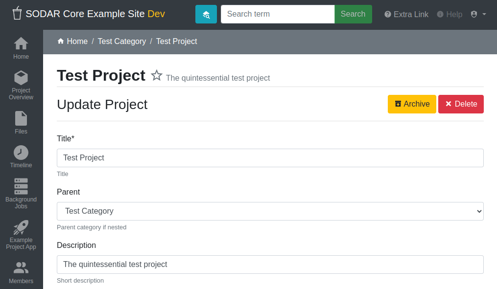
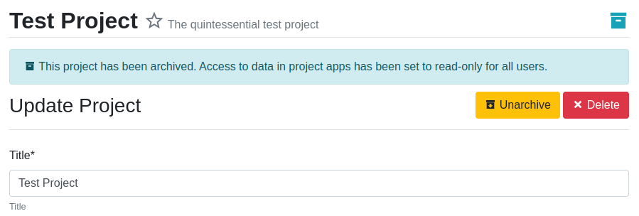

.. _app_projectroles_usage:

Projectroles Usage
^^^^^^^^^^^^^^^^^^

This document provides instructions for using the ``projectroles`` app which has
been integrated into your Django site.

.. hint::

    Detailed instructions for many pages can be found in an interactive tour by
    clicking the "Help" link in the right side of the top navigation bar.

Before reading this document, be sure to see :ref:`app_projectroles_basics` for
basic concepts regarding the use of this app.

Logging In
==========

Unless anonymous access is specifically set on the site, apart from specific
public or token-enabled views, user login is **mandatory** for using a SODAR
Core based Django site.

One can either log in using a local Django user or, if LDAP/AD is enabled, their
LDAP/AD credentials from a supported site. In the latter case, the user domain
must be appended to the user name in form of ``user@DOMAIN``.

If OpenID Connect (OIDC) single-sign on authentication is enabled, an extra
login element will be displayed next to the standard login controls. This will
take the user to the login view of the OIDC provider. The element can be
replaced with a custom template to e.g. use specific graphics recommended by the
provider.

.. figure:: _static/app_projectroles/sodar_login.png
    :align: center
    :scale: 75%

    SODAR Core login form

User Interface
==============

Basics
------

Upon logging into a SODAR Core based Django site using default templates and CSS,
the general view of your site is split into the following elements:

- **Top navigation bar**: Contains the site logo and title, search element, link
  to advanced search, help link and the user dropdown.
- **User dropdown**: Contains links to user management, admin site and
  site-wide apps the user has access to.
- **Project sidebar**: Shortcuts to project apps and project management pages
- **Project navigation**: Project structure breadcrumb (disabled for site apps)
- **Content**: Actual app content goes in this element
- **Footer**: Optional footer with e.g. site info and version

    Home view

    User dropdown

Home View
---------

As content within a SODAR Core based site is by default sorted into projects,
the home view displays a tree view of categories and projects to choose from.
You can filter the list with a search term or restrict display to your starred
projects.

.. hint::

    If you have been granted a *finder* role to a category, projects under it
    will be visible in the list as grayed out text instead of links. You can
    navigate to the parent category and see the member roles there in order to
    request access to a project from an owner or delegate.

Project Detail View
-------------------

The project detail page dynamically imports elements from installed project
apps, usually showing e.g. overview of latest additions to app data, statistics
and/or shortcuts to app functionalities. Here you can also access project apps
from the project sidebar. For project apps, the sidebar link leads to the app
entry point view as defined in the app plugin.

For each page in a project app which extends the default projectroles template
layout, the **project title bar** is displayed on the top of the page. This
contains the project title and description and a link to "star" the project into
your favourites. Below this, the **project app title bar** with possible
app-specific controls is usually displayed.

    Project detail view

Category and Project Management
===============================

In SODAR based sites, data is split into **categories** and **projects**.
Categories may be freely nested and are used as containers of projects. They
may contain a description and readme, but project apps are disabled for
categories unless explicitly enabled. Projects can not be nested within each
other.

.. note::

    Content displayed on the form varies depending on the type of container
    (category or project) being edited. E.g. most app settings are only
    available when creating or updating a project.

Creating a Top Level Category
-----------------------------

Currently, only users with a superuser status can create a top level category.
This can be done by navigating to the *home view* and clicking the
**Create Category** link. To create a category, a name and owner must be
supplied, along with optional description and/or a readme document. All of these
may be modified later.

.. note::

    Currently, only users already previously logged into the system can be added
    as the owner of a category or project. The ability to invite users not yet
    on the site as owners will be added later.

.. hint::

    When setting up a new site, think about what kind of category and project
    structure makes sense for your team and organization. Moving projects and
    categories under different categories is possible, but is not recommended
    and can currently only be done via the admin view or directly in the Django
    shell.

    Category/project creation form

Creating Categories and Projects
--------------------------------

Once navigating into a category, a user with sufficient access will see the
**Create Project or Category** link in the side bar. This opens up a form for
adding a project or a nested category under the current category. The form is
identical to top level category creation, except that you can also choose
between creating a project or a category.

Users with the role of *project contributor* or higher in a category are allowed
to create a project within that category.

Updating Categories and Projects
--------------------------------

An existing project or category can be updated from the
**Update Project/Category** link in the side bar. Again, a similar form as
before will be presented to the user. The owner can not be changed here, but
must be modified in the *Members* view instead. It is possible to move the
current category or project under another category by altering the ``parent``
field. The user who does the updating must have a sufficient role in the
target category or superuser status.

    Category/project updating form

.. note::

    For remote project synchronized from another SODAR Core based site, you can
    only edit local application settings in this view.

Public Guest Access
-------------------

From the project create/update view, setting *Public Guest Access* will give
everyone in the system read-only guest access in the project without
specifically granting it.

.. warning::

    If the site has been configured to allow in anonymous users, this will also
    make the project available to anyone who can access the site in your
    network! Please use this feature carefully.

.. note::

    Public guest access can only be set for projects. Categories will be visible
    for users with access to any category or project under them.

Access on Remote Sites
----------------------

In the project create/update view, owners and delegates can modify remote site
access to projects. This is available for sites where these controls have been
enabled by administrators. The sites will appear as checkboxes as
:guilabel:`Enable project on {SITE-NAME}`.

For more information, see :ref:`app_projectroles_usage_remote`.

App Settings
------------

Project and site apps may define :term:`app settings<App Settings>`, which can
be either be set with the scope of *project*, *user* or *user within a project*.

Widgets for project specific settings will show up in the project creation and
updating form and can only be modified by users with sufficient project access.
User specific settings will be displayed in the
:ref:`Userprofile app <app_userprofile>`.

Certain project app settings may appear only for categories, only for projects
or for both container types.

By defining the attribute ``user_modifiable=False``, project or user app
settings will not be shown in the respective project/user update views. This is
used e.g. in cases where a project app provides its own UI or updates some
"hidden" setting due to user actions. Superusers will still see these hidden
settings in the Update Project view.

Settings with the scope of user within a project do not currently have a
separate UI of their own. Instead, project apps can produce their own user
specific UIs for this functionality if manual user selection is needed.

The projectroles app provides the following built-in app settings with the
project scope:

- ``ip_restrict``: Restrict project access by an allowed IP list if enabled.
- ``ip_allowlist``: List of allowed IP addresses for project access.

To clean up settings which have been stored in the database but have since
been removed from the plugin app settings definitions, run the following
management command:

.. code-block::

    $ ./manage.py cleanappsettings

Project Archiving
-----------------

In the project update view it is possible to archive a project. Clicking the
:guilabel:`Archive` button and confirming this action in the next view will set
data modification from project access to read-only. User roles can still be
granted, but contributors can no longer edit data in project apps.

The project update view will still be available for owners and delegates for
updating basic project metadata. Superusers will be able to edit project data
regardless of its archiving status.

To undo archiving, the project can be unarchived from the same button on top of
the project update view, now labeled :guilabel:`Unarchive`.

    Archived project and unarchive button in project update view

Project Deletion
----------------

The option to permanently delete a project is also available for owners and
delegates in the project update view. The :guilabel:`Delete` button is found
next to the project archiving button.

Deletion is disabled for categories which have nested child categories or child
projects. In such cases, the children must be individually deleted first. This
is done deliberately to decrease the chance of accidental deletion of multiple
projects.

If remote access for a project has been granted on target sites, access needs to
be revoked before the project can be deleted. Similarly, a project on a target
site can only be deleted if its access has been revoked on the source site. For
more information, see :ref:`app_projectroles_usage_remote`.

    Project deletion confirmation form

Clicking the :guilabel:`Delete` button will take you to a form for confirming
the deletion. You will have to write the host name of the SODAR Core site to
confirm the action.

.. danger::

    Deletion will permanently wipe out all data associated with a category or
    project. This operation can not be undone!

Member Management
=================

Project member roles can be viewed and modified through the **Members**
link on the sidebar. Modification requires a sufficient role in the project or
category (owner or delegate) or superuser status.

.. figure:: _static/app_projectroles/sodar_role_list.png
    :align: center
    :scale: 55%

    Project member list view

All members of categories automatically inherit identical access rights to
subcategories and projects under those categories. Inherited member roles can be
promoted to a higher local role, but demoting to a lesser role for child
categories or projects is not allowed.

For inherited members, the member list displays a link to the category where
the inheritance is derived from. Inherited members can not be removed or edited
locally, with the exception of promoting a user to a higher role.

Adding Members
--------------

There are two ways to add new members to a project or a category:

- **Add Member** is used to add member roles to system users.
- **Invite Member** is used to send email invites to users not yet registered
  in the system.

Addition or modification of users sends an email notification to the user in
question if email sending is enabled on your Django server. The emails can be
previewed in corresponding forms.

.. hint::

    It is also possible to create an invite in the Add Member form. Inviting is
    enabled when inputting an email address not found among the system users.

Modifying Members
-----------------

Changing or removing user roles can be done from links next to each role on the
member list. Category or project ownership can be transferred to another user
who currently has a role in the project by using the dropdown next to the owner
role.

Invites
-------

Invites are accepted by the responding user clicking on a link supplied in their
invite email. Depending on how the site is configured, users can then either
login to the site using their LDAP/OIDC credentials or create a local user. The
latter is only allowed if local users are enabled in the site's Django settings
and the user email domain is not associated with configured LDAP domains.
Invites expire after a certain time and can be reissued or revoked on the
:guilabel:`Project Invites` page.

.. note::

    Inviting a user is prohibited if they already have an active invite in a
    parent category of the current category or project.

Leaving a Project
-----------------

A user may leave a category or project by clicking the
:guilabel:`Leave Category` or :guilabel:`Leave Project` button in the role list
view. Leaving a category will also remove the user's access to child categories
and projects, except for cases where another role has specifically been assigned
for them in children.

This operation can not be undone. To regain access, an owner or a delegate must
re-add the user to the category or project.

Owners are not able to directly leave a project. Instead, the owner role must be
transferred to another user. To do this, the user must select
:guilabel:`Transfer Ownership` in their role dropdown.

Batch Member Modifications
--------------------------

Batch member updates can be done either by using REST API views with appropriate
project permissions, or by a site admin using the ``batchupdateroles``
management command. The latter supports multiple projects in one batch. It is
also able to send invites to users who have not yet signed up on the site.

Remove All Roles from User
--------------------------

To easily remove all roles from a user, use the ``removeroles`` management
command. For owner roles, you can supply the user name of a user for whom to
transfer those roles. If no owner is supplied, each ownership will be
transferred to the parent category owner. Example:

.. code-block:: console

    $ ./manage.py removeroles --user alice --owner bob

User Status Checking
--------------------

An administrator can check status of external LDAP user accounts using the
``checkusers`` management command. This will list accounts disabled or locked
out of the LDAP server. Use the ``-h`` flag to see additional options.

.. code-block:: console

    $ ./manage.py checkusers

Site App Settings
=================

Site-wide app settings, which are not tied to any project or user, can be
altered by administrators by opening the :guilabel:`Site App Settings` view from
their user dropdown. The form works similarly to the project app settings in the
project creation and updating view.

    Site app settings view

Site Read-Only Mode
===================

In :guilabel:`Site App Settings`, an administrator can temporarily set the site
to read-only mode. When this mode is enabled, all data on the site is only
accessible for reading. No project or user data should be modifiable. Once
enabled, the mode must be explicitly disabled from the same form.

While the mode is active, an alert will be displayed to all users that site data
can currently not be modified.

Once the mode has been disabled, the alert on existing browser views will be
changed into one prompting the user to reload the current view. Reloading
ensures all the UI elements are active in case not everything is updated on the
client side.

.. _app_projectroles_usage_remote:

Remote Projects
===============

It is possible to sync project metadata and member roles between multiple SODAR
Core based Django sites. Remote sites and access can be managed in the
**Remote Site Access** site app, found in the user dropdown menu in the top
navigation bar.

Alternatively, remote sites can be created using the following management
command:

.. code-block:: console

    $ ./manage.py addremotesite

In the current implementation, your django site must either be in **source** or
**target** mode. A source site can define one or multiple target sites where
project data can be provided. A target site can define exactly one source site,
from which project data can be retrieved from.

To enable remote project data and member synchronization, you must first set up
either a target or a source site depending on the role of your own SODAR Core
based site.

    Remote site list in source mode

As Source Site
--------------

Navigate to the **Remote Site Access** site app and click on the
:guilabel:`Add Target Site` button. You will be directed to a form for
specifying the remote site. A secret string is generated automatically. You
need to provide this to the administrator of the target site in question for
accessing your site.

Fields for target remote site creation:

Name
    Name of the remote site.
URL
    URL for the remote site, e.g. ``https://sodar-core-site.example.com``.
Description
    Text description for the site.
User display
    If set false, this will hide the remote project links from your users.
    Users viewing the project on the source site then won't see a link to the
    target site. Owners and superusers will still see the link (greyed out).
    This is most commonly used for internal test sites which only needs to be
    used by admins.
Owner modifiable
    If this and :guilabel:`User display` are checked, owners and delegates can
    control project visibility on this site in the project create/update view.
Secret
    Secret token for the project, which must be set to an identical value
    between source and target sites.

    Remote site create/update view viewed as a source site

Once created, you can access the list of projects on your site in regards to the
created target site. For each project, you may select an access level, of which
three are currently implemented:

No Access
    No access on the remote site (default).
Read Roles
    This allows for the target site to read project metadata *and* user roles in
    order to synchronize project access remotely.
Revoked Access
    Previously available access which has been revoked. The project will still
    remain in the target site, but only superusers, the project owner or the
    project delegate(s) can access it.

Once desired access to specific projects has been granted and confirmed, the
target site will sync the data by sending a request to the source site.

    Remote project list viewed as a source site

.. note::

    The *read roles* access level also provides metadata of the categories above
    the selected project so that the project structure can be maintained.

.. note::

    Only LDAP/AD user roles and local administrator *owner* roles are provided
    to the target site. Other local user roles are ignored.

.. note::

    Access levels for purely checking the existence of the project and only
    reading project metadata (title, description..) without member roles are
    implemented in the data model and backend, but currently disabled in the UI.

.. note::

    If synchronizing a project with *public guest access* enabled, this setting
    is **not** automatically set on the target site. If you wish to make the
    project also publicly accessible on the target site, it needs to be
    explicitly set by the project owner, delegate or a superuser in the
    :guilabel:`Update Project` form.

As Target Site
--------------

The source site should be set up as above by cllicking on the
:guilabel:`Set Source Site` button and filling out the corresponding form. Use
the secret string provided by the source site as the access token.

After creating the source site, remote project metadata and member roles can be
retrieve the :guilabel:`Synchronize` option in the site dropdown found in the
*Remote Sites* view on the target site. Additionally, if the remote source site
is synchronized with multiple target Sites, information about those other target
sites will be synchronized as well an displayed as *Peer Sites*.

To set up automated project and member sync from the source site, you will need
to run a Celery worker with Celerybeat enable. Then, set the Django setting
``PROJECTROLES_TARGET_SYNC_ENABLE`` to ``True`` and optionally set the value for
``PROJECTROLES_TARGET_SYNC_INTERVAL``. For more information, see
:ref:`app_projectroles_settings`.

Alternatively, the following management command can be used:

.. code-block:: console

    $ ./manage.py syncremote

.. note::

    Creating local projects under a category synchronized from a remote source
    site is **not** allowed. For having local projects on a target site, you
    should create and use a local root category.

.. note::

    If a local user is the owner of a synchronized project on the source site,
    the user defined in the ``PROJECTROLES_DEFAULT_ADMIN`` will be given the
    owner role. Hence you **must** have this setting defined if you are
    implementing a SODAR Core based site in target mode.

.. note::

    Local non-owner users can be granted roles if
    ``PROJECTROLES_ALLOW_LOCAL_USERS`` is set on the target site. However, local
    users must be manually created by a target site admin in order for their
    data and roles to be synchronized.

Project Detail View Links
-------------------------

Links to the same project on other sites will appear in the
:guilabel:`Project on Other Sites` card in the project detail view. If the
remote site has not yet synchronized this project, the link will appear grayed
out and unclickable. On a remote site, the source project will be labeled as
such.

    Remote project links in the project detail view

Search
======

The basic search form is displayed in the top navigation bar if enabled. It
takes one string as a search parameter, followed by optional keyword argument.
At this time, the keyword of ``type`` has been implemented, used to limit the
search to a certain data type as specified in app plugins.

Left to the basic search form is a link to the *Advanced Search* page, where you
can currently search for items using multiple search terms combined with the OR
operator.

Search results are split into results from different apps. For example, entering
``test`` will return all objects from all apps containing this string.
Alternatively, entering ``test type:project`` will provide results from any app
configured to produce results of type *project*. By default, this will result in
the projectroles app listing projects which contain the search string in their
name and/or description.

.. note::

    Additional features such as full-text search and more keywords/operators
    will be defined in the future.

REST API
========

Many SODAR Core features are also available via a REST API. See
:ref:`app_projectroles_api_rest` for instructions on REST API usage.
